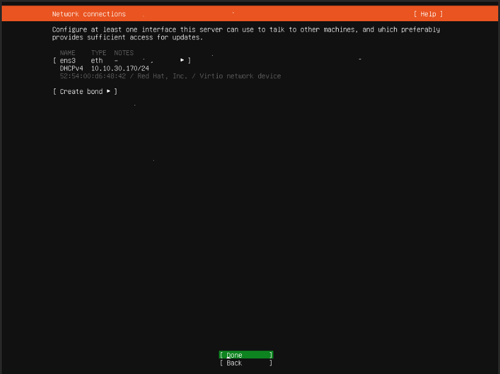

# Hướng dẫn đóng image Ubuntu 20.04 với cloud-init và QEMU Guest Agent (không dùng LVM)

## Chú ý:

- Hướng dẫn này dành cho các image không sử dụng LVM
- Sử dụng công cụ virt-manager hoặc web-virt để kết nối tới console máy ảo
- OS cài đặt KVM là Ubuntu 20.04 (Live Server)
- Phiên bản OpenStack sử dụng là Queens
- Hướng dẫn bao gồm 2 phần chính: thực hiện trên máy ảo cài OS và thực hiện trên KVM Host
- Nên để VM name là Template_Ubuntu20.04
- Nên để VM disk name là Template_Ubuntu20.04.qcow2 định dạng qcow2
- Nên để size disk 10GB
- Driver disk để virtio
- Driver interface để virtio

----------------------

## Bước 1: Tạo máy ảo 

### Cách 1: Trên Webvirt
### Cách 2: Trên Virt-manager





## Bước 2 : Tắt máy ảo, xử lí trên KVM host

- Chỉnh sửa file `.xml` của máy ảo, bổ sung thêm channel trong <devices> (để máy host giao tiếp với máy ảo sử dụng qemu-guest-agent), sau đó save lại

`virsh edit Template_Ubuntu20.04`

với `Template_Ubuntu20.04` là tên máy ảo

``` sh
...
<devices>
 <channel type='unix'>
      <target type='virtio' name='org.qemu.guest_agent.0'/>
      <address type='virtio-serial' controller='0' bus='0' port='1'/>
 </channel>
</devices>
...
```
> Nếu đã tồn tại `channel` đổi port channel này về `port='2'` và add channel bình thường


## 2. Thực hiện trên máy ảo cài đặt các dịch vụ cần thiết 

### 2.1. Setup môi trường 

Bật máy ảo lên, truy cập vào máy ảo. Lưu ý với lần đầu boot, bạn phải sử dụng tài khoản `ubuntu` tạo trong quá trình cài os, chuyển đổi nó sang tài khoản root để sử dụng.

Cấu hình cho phép login root và xóa user `ubuntu` chỉnh `/etc/ssh/sshd_config`
```sh
sudo sed -i 's/#PermitRootLogin prohibit-password/PermitRootLogin yes/'g /etc/ssh/sshd_config
service sshd restart
```

Đặt passwd cho root
```sh
sudo su 
# Đặt passwd cho root user
passwd
Enter new UNIX password: <root_passwd>
Retype new UNIX password: <root_passwd>
```

Restart sshd
```sh
sudo service ssh restart
```

Disable firewalld 
```sh
sudo apt-get install ufw -y
sudo ufw disable
```

Logout hẳn ra khỏi VM 
```sh 
logout 
```

Login lại bằng user `root` và xóa user `ubuntu`
```sh
userdel ubuntu
rm -rf /home/ubuntu
```

Đổi timezone về `Asia/Ho_Chi_Minh`
```sh
timedatectl set-timezone Asia/Ho_Chi_Minh
```

Bổ sung env locale 
```sh 
echo "export LC_ALL=C" >>  ~/.bashrc
```

Disable ipv6
```sh
echo "net.ipv6.conf.all.disable_ipv6 = 1" >> /etc/sysctl.conf 
echo "net.ipv6.conf.default.disable_ipv6 = 1" >> /etc/sysctl.conf 
echo "net.ipv6.conf.lo.disable_ipv6 = 1" >> /etc/sysctl.conf
sysctl -p
cat /proc/sys/net/ipv6/conf/all/disable_ipv6
```
> Output: 1: OK, 0: NotOK

Update 
```sh
sudo apt-get update -y 
sudo apt-get upgrade -y 
sudo apt-get dist-upgrade -y
sudo apt-get autoremove 
```

Kiểm tra swap file 
```sh 
root@ubuntu:~# cat /proc/swaps
Filename				Type		Size	Used	Priority
/swap.img                               file		2023420	0	-2
```

Xóa swap 
```sh 
swapoff -a
rm -rf /swap.img
```

Xóa cấu hình swap file trong file `/etc/fstab`
```sh 
sed -Ei '/swap.img/d' /etc/fstab
```
> Kiểm tra 
```sh
root@ubuntu:~# free -m 
          total        used        free      shared  buff/cache   available
Mem:           1993         127         699           1        1166        1691
Swap:             0           0           0
```

Cấu hình để instance báo log ra console và đổi name Card mạng về eth* thay vì ens, eno
```sh
sed -i 's|GRUB_CMDLINE_LINUX=""|GRUB_CMDLINE_LINUX="net.ifnames=0 biosdevname=0 console=tty1 console=ttyS0"|g' /etc/default/grub
update-grub
```

Cấu hình network sử dụng ifupdown thay vì netplan

- Cài đặt service ifupdown 
```sh
apt-get install ifupdown -y
```

- Disable netplan
```sh
cat << EOF > /etc/cloud/cloud.cfg.d/99-disable-network-config.cfg
network: {config: disabled}
EOF

rm -rf /etc/netplan50-cloud-init.yaml
```

- Tạo file interface
```sh
cat << EOF > /etc/network/interfaces
auto lo
iface lo inet loopback
auto eth0
iface eth0 inet dhcp
EOF
```

Reboot lại Server kiểm tra `eth0`, network

> ## Tiến hành SNAPSHOT lại KVM host để lưu trữ và đóng gói lại khi cần thiết

## 3. Cài đặt các phần mềm bổ sung 

Start lại VM login bằng user root

Cài đặt các Sofware phần mềm cần thiết (Nếu có )
- Plesk, DA, ...
- Gitlab, Owncloud

> ## Tiến hành SNAPSHOT lại KVM host để lưu trữ và đóng gói lại khi cần thiết

## 4. Cài đặt các agent cho VM 

Login vào VM bằng User ROOT

Để máy ảo khi boot sẽ tự giãn phân vùng theo dung lượng mới, ta cài các gói sau:
```
sudo apt-get install cloud-utils cloud-initramfs-growroot -y
```

Để sau khi boot máy ảo, có thể nhận đủ các NIC gắn vào:
```sh
sudo apt-get install netplug -y
wget https://raw.githubusercontent.com/uncelvel/create-images-openstack/master/scripts_all/netplug_ubuntu -O netplug
mv netplug /etc/netplug/netplug
chmod +x /etc/netplug/netplug
```

Cấu hình user default
```sh
sed -i 's/name: ubuntu/name: root/g' /etc/cloud/cloud.cfg
```

Xóa bỏ thông tin của địa chỉ MAC
```sh
echo > /lib/udev/rules.d/75-persistent-net-generator.rules
echo > /etc/udev/rules.d/70-persistent-net.rules
```

Disable default config route
```sh
sed -i 's|link-local 169.254.0.0|#link-local 169.254.0.0|g' /etc/networks
```

Cài đặt `qemu-guest-agent`

> ### Chú ý: qemu-guest-agent là một daemon chạy trong máy ảo, giúp quản lý và hỗ trợ máy ảo khi cần (có thể cân nhắc việc cài thành phần này lên máy ảo)

Để có thể thay đổi password máy ảo thì phiên bản qemu-guest-agent phải >= 2.5.0
```
apt-get install software-properties-common -y
add-apt-repository cloud-archive:rocky -y
apt-get update -y
apt-get install qemu-guest-agent -y
```

> Kiểm tra phiên bản `qemu-ga` bằng lệnh:
```
qemu-ga --version
service qemu-guest-agent status
```

Kết quả:
```
QEMU Guest Agent 2.11.0
* qemu-ga is running
```

Cấu hình datasource 

 - Bỏ chọn mục `NoCloud` bằng cách dùng dấu `SPACE`, sau đó ấn `ENTER`
```sh
dpkg-reconfigure cloud-init
```

 

Clean cấu hình và restart service :
```sh
cloud-init clean
systemctl restart cloud-init
systemctl enable cloud-init
systemctl status cloud-init
```
> Thao tác `restart cloud-init` có thể tốn 2-3p để rebuild lại các config của Cloud-init

Clear toàn bộ history 
```sh 
apt-get clean all
rm -f /var/log/wtmp /var/log/btmp
history -c
```

- Shutoff máy
```sh
init 0
```

## 5. Thực hiện trên Host KVM

Xử dụng lệnh `virt-sysprep` để xóa toàn bộ các thông tin máy ảo:
```
virt-sysprep -d Template_Ubuntu20.04
```

Dùng lệnh sau để tối ưu kích thước image:
```sh
virt-sparsify --compress --convert qcow2 /var/lib/libvirt/images/Template_Ubuntu20.04.qcow2 Template_Ubuntu20.04
```

## 6. Upload image lên glance và sử dụng
Nếu có dùng Ceph thì thực hiện chuyển đổi về `raw`
```sh 
qemu-img convert -O raw Template_Ubuntu20.04.qcow2 Template_Ubuntu20.04.raw
```

```
glance image-create \
--name Template_Ubuntu20.04 \
--file Template_Ubuntu20.04.raw \
--disk-format raw \
--container-format bare \
--visibility=public \
--property os_type=linux \
--property hw_qemu_guest_agent=yes \
--property vps_image_user=root \
--property vps_image_type=Ubuntu\
--property vps_image_app=false\
--min-disk 10 \
--min-ram 1024 \
--progress
```
